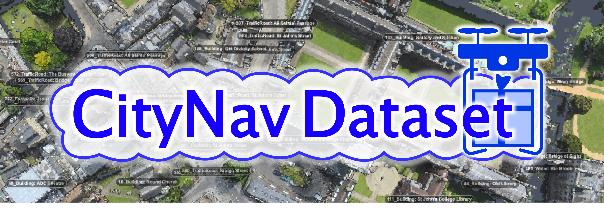
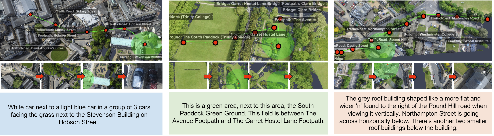

# CityNav: Language-Goal Aerial Navigation Dataset with Geographic Information



## Introduction

The official repository for [CityNav: Language-Goal Aerial Navigation Dataset with Geographic Information](https://arxiv.org/abs/2406.14240).

Vision-and-language navigation (VLN) aims to guide autonomous agents through complex environments by integrating visual and linguistic inputs.
While various methods have been proposed to combine these modalities, most existing VLN datasets focus on ground-level navigation.
This leaves aerial navigation largely unexplored due to the lack of suitable training and evaluation resources.
To address this gap, we introduce CityNav, a new dataset for language-goal aerial navigation using a 3D point cloud representation of real cities.
It includes 32,637 natural language descriptions matched with demonstration trajectories, collected from human participants through our newly developed web-based 3D simulator.
Each description specifies a navigation goal, leveraging the names and locations of landmarks within the real-world city.
We also provide baseline models of navigation agents that incorporate an internal 2D spatial map representing landmarks referenced in the instructions.
We benchmark the latest aerial navigation baselines and our proposed model on the CityNav dataset.
The results reveal the following key findings: (i) The proposed models trained on human demonstration trajectories outperform those trained on shortest path trajectories, highlighting the importance of human-driven navigation strategies. (ii) Integrating a 2D spatial map significantly enhances navigation efficiency at city scale.

Please check out the project website at <a href="https://water-cookie.github.io/city-nav-proj/" target="_blank">https://water-cookie.github.io/city-nav-proj/</a> .


## Setup

This code was developed with Python 3.10, PyTorch 2.2.2, and CUDA 11.8 on Ubuntu 22.04.

To set up the environment, create the conda environment and install PyTorch.

```bash
conda create -n mgp python=3.10 &&
conda activate mgp &&
conda install pytorch torchvision pytorch-cuda=11.8 -c pytorch -c nvidia
```

Then install Set-of-Marks and its dependencies.

```bash
conda install mpi4py

pip install git+https://github.com/water-cookie/Segment-Everything-Everywhere-All-At-Once.git@package
pip install git+https://github.com/water-cookie/Semantic-SAM.git@package
pip install git+https://github.com/facebookresearch/segment-anything.git 

git clone https://github.com/water-cookie/SoM.git  &&
cd SoM/ops && ./make.sh && cd ..  &&
pip install --editable . && cd ..
```

Next, install LLaVA and Grounding DINO.

```bash
pip install git+https://github.com/water-cookie/LLaVA.git
pip install git+https://github.com/IDEA-Research/GroundingDINO.git
pip install git+https://github.com/ChaoningZhang/MobileSAM.git
```

Once LLaVA and Grounding DINO are installed, install the dependencies for CityNav.

```bash
pip install -r requirements.txt
```

Finally, the weights can be downloaded by running the following script.

```bash
sh scripts/download_weights.sh
```

The downloaded weight files shoud be organized in the following heirarchy.

```text
CityNav/
├─ weights/
│  ├─ groundingdino/
│  │  ├─ groundingdino_swinb_cogcoor.pth
│  │  ├─ groundingdino_swint_ogc.pth
│  ├─ mobile_sam/
│  │  ├─ mobile_sam.pt
│  ├─ som/
│  │  ├─ sam_vit_h_4b8939.pth
│  │  ├─ seem_focall_v1.pt
│  │  ├─ swinl_only_sam_many2many.pth
│  ├─ vlnce/
│  │  ├─ ddppo-models/
│  │  │  ├─ gibson-2plus-resnet50.pth
│  │  │  ├─ ...
│  │  ├─ R2R_VLNCE_v1-3_preprocessed/
│  │  │  ├─ embeddings.json.gz
│  │  │   ...
```

To run CMA/Seq2Seq models, run the following instead.

```bash
conda create -n vlnce python=3.10 &&
conda activate vlnce &&
conda install pytorch torchvision pytorch-cuda=11.8 -c pytorch -c nvidia &&

pip install gymnasium opencv-python pillow rasterio shapely tqdm transformers wandb &&
pip install msgpack-rpc-python &&
pip install airsim
```

## Data Preparation

The dataset can be downloaded with the following script.

```bash
sh scripts/download_data.sh
```

Download [SensatUrban dataset](https://github.com/QingyongHu/SensatUrban?tab=readme-ov-file#4-training-and-evaluation)
and run the following script to rasterize the pointclouds.

```bash
sh scripts/rasterize.sh path_to_ply_dir/train
sh scripts/rasterize.sh path_to_ply_dir/test
```

The dataset and images should be placed in the directories presented below.

```bash
citynav/
├─ data/
│  ├─ cityrefer/
│  │  ├─ objects.json
│  │  ├─ processed_descriptions.json
│  ├─ citynav/
│  │  ├─ citynav_train_seen.json
│  │  ├─ ...
│  ├─ rgbd/
│  │  ├─ birmingham_block_0.png
│  │  ├─ birmingham_block_0.tiff
│  │  ├─ ...
│  ├─ gsam/
│  │  ├─ full_scan_(100, 240, 410).npz
```

## Usage

Run the following script to train MGP model with the human-collected trajectories.

```bash
python main_goal_predictor.py \
    --mode train \
    --altitude 50 \
    --gsam_use_segmentation_mask \
    --gsam_box_threshold 0.20 \
    --learning_rate 0.0015 \
    --train_batch_size 12 \
    --train_trajectory_type mturk
```

Once the checkpoint has been saved, use the following script to evaluate the checkpoint.

```bash
python main_goal_predictor.py \
    --mode eval \
    --altitude 50 \
    --gsam_use_segmentation_mask \
    --gsam_box_threshold 0.20 \
    --eval_batch_size 200 \
    --eval_max_timestep 20 \
    --checkpoint path/to/checkpoint
```

The target and surrounding maps for training is cached in the file `data/gsam/full_scan_(100, 240, 410).npz`.
To use the cached maps, add the argument `--gsam_use_map_cache` to the training script.

## Pretrained Models

| Baselines       | NE(m) | SR(%) | OSR(%) | SPL(%)| Checkpoints |
|-----------------|-------|-------|--------|-------|-------------|
| Seq2Seq w/ SP   | 174.5 | 1.73  |  8.57  | 1.69  | [💾](https://www.dropbox.com/scl/fi/l1pkjkqp9cg72u6x398hh/seq2seq_sp.pth?rlkey=8f9l6n2l6eaktmtgdu4af8u9x&dl=0)     |
| Seq2Seq w/ HD   | 245.3 | 1.50  |  8.34  | 1.30  | [💾](https://www.dropbox.com/scl/fi/aljfwcdkt8dmwoxsr35d3/seq2seq_mturk.pth?rlkey=68s49ze697x1f5ahrbyz2l5c1&dl=0)     |
| CMA w/ SP       | 179.1 | 1.61  | 10.07  | 1.57  | [💾](https://www.dropbox.com/scl/fi/lcsvfv12w099j2qrf4b69/cma_sp.pth?rlkey=949z1haycpn3v3lung23cq5ok&dl=0)     |
| CMA w/ HD       | 252.6 | 0.82  |  9.70  | 0.79  | [💾](https://www.dropbox.com/scl/fi/ubfzccbx4mm9nycdr8lp8/cma_mturk.pth?rlkey=5997km0vlbfzntnh20noov6eu&dl=0)     |
| MGP w/ SP | 109.0 | 4.73  | 17.47  | 4.62  | [💾](https://www.dropbox.com/scl/fi/ijw6n748erb0n1ek5o0ok/mgp_sp.pth?rlkey=ygnms63elcpp059drouov0h09&dl=0)     |
| MGP w/ HD |  93.8 | 6.38  | 26.04  | 6.08  | [💾](https://www.dropbox.com/scl/fi/xoz7mzv4fddwktn961chg/mgp_mturk.pth?rlkey=r80r51gtu38mfx022md3gmq7m&dl=0)     |

## Qualitative Results



## Citation

```bibtex
@misc{lee2024citynavlanguagegoalaerialnavigation,
      title={CityNav: Language-Goal Aerial Navigation Dataset with Geographic Information}, 
      author={Jungdae Lee and Taiki Miyanishi and Shuhei Kurita and Koya Sakamoto and Daichi Azuma and Yutaka Matsuo and Nakamasa Inoue},
      year={2024},
      eprint={2406.14240},
      archivePrefix={arXiv},
      primaryClass={cs.CV},
      url={https://arxiv.org/abs/2406.14240}, 
}
```

## License

- CityNav Dataset : [CC BY 4.0](https://creativecommons.org/licenses/by/4.0/legalcode)
- Codebase : [MIT License](https://anonymous.4open.science/r/citynav-6CFE/LICENSE)

## Acknowledgements

We would like to express our gratitude to the authors of the following codebase.

- [VLN-CE](https://github.com/jacobkrantz/VLN-CE)
- [Grounding DINO](https://github.com/IDEA-Research/GroundingDINO)
- [Semantic-SAM](https://github.com/UX-Decoder/Semantic-SAM)
- [MobileSAM](https://github.com/ChaoningZhang/MobileSAM)
- [Set-of-Mark prompting](https://github.com/microsoft/SoM)
- [LLaVA](https://llava-vl.github.io/)
